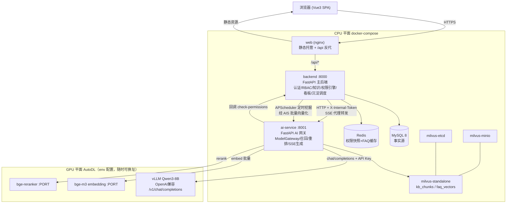
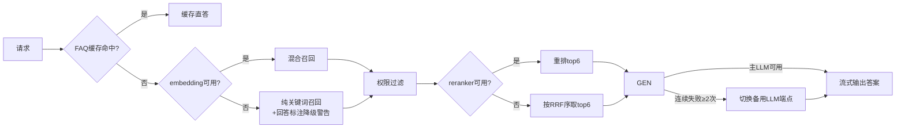
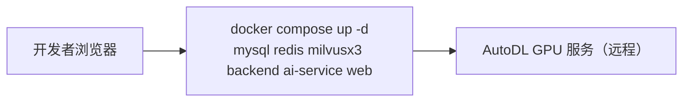
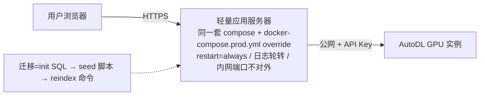

# 软件架构文档（SAD）— 企业级知识库管理平台 kb-platform

| 项 | 内容 |
|----|------|
| 文档版本 | v1.0 |
| 状态 | 已评审（设计对话确认） |
| 日期 | 2026-02-26 |
| 上游文档 | docs/srd/SRD.md |
| 下游文档 | docs/sdd/SDD.md、开发手册 |

---

## 1. 架构目标与约束

| 目标/约束 | 说明 |
|-----------|------|
| 工期约束 | 1.5 天完成编码与部署，复杂度必须有上限 |
| 关注点分离 | 模型推理依赖（GPU、易变地址、多协议）必须收敛到单一服务 |
| 数据安全 | 数据权限是核心卖点，必须在检索链路内强制生效，而非前端过滤 |
| 可重建性 | 向量库是派生资产，任何时刻可从关系库全量重建 |
| 环境漂移 | GPU 服务地址随 AutoDL 实例变化，全部配置化 |
| 成本 | AutoDL 按量计费，CPU 云服务器 4C8G 档位 |

## 2. 总体架构

**信任边界**：浏览器 ↔ backend 之间是用户信任域（JWT）；backend ↔ ai-service 之间是内部信任域（X-Internal-Token 共享密钥，compose 内网互通，不对公网暴露端口）。ai-service 无 MySQL 凭据，权限判断只能回调 backend——保证权限规则只有一份实现。

## 3. 服务职责边界

| 服务 | 职责 | 明确不做 |
|------|------|---------|
| web | SPA 静态托管、同域反消 CORS、gzip | 不做业务逻辑 |
| backend | JWT 签发校验、RBAC 拦截、组织/角色/部门、知识单元与导入任务、**权限引擎唯一实现**、看板聚合、FAQ 管理、APScheduler 沉淀作业、qa_access_logs 落库 | 不直接调用任何模型 API |
| ai-service | ModelGateway（LLM 主备/embed/rerank 适配）、FAQ 缓存两级命中判断、混合召回、RRF 融合、权限回调、Prompt 组装、SSE 流式生成与用量采集 | 不持有 MySQL 连接；不自行判断权限 |
| MySQL | 全部业务事实源（13 张表） | 不存明文密码 |
| Milvus | 派生向量索引（kb_chunks、faq_vectors） | 不作为事实源 |

## 4. 架构决策记录（ADR）

### ADR-001 AI 能力独立为 ai-service 微服务
- **背景**：模型调用具有 GPU 依赖、多协议（vLLM OpenAI 兼容 / 自定义 rerank）、地址易变三个特征。
- **决策**：独立 FastAPI 服务收敛全部模型访问，backend 通过内网 HTTP+SSE 代理消费。
- **备选**：单体后端内嵌模型模块（更快，但模型故障/换址会牵连主业务发布）。
- **后果**：多一个服务约 +0.5 天成本；换来模型层可独立重启、独立替换、故障隔离。

### ADR-002 向量库选型 Milvus standalone
- **决策**：Milvus standalone（etcd+minio 三容器）。
- **备选否决**：Qdrant（更轻，1 容器，但团队选择 Milvus 的生态与叙事）；pgvector（最省事，但与"MySQL+独立向量库"的既定选型冲突）。
- **后果**：部署面 +2 容器，内存预算需 ≥4G；换取分布式向量库的完整能力与生态关键词。

### ADR-003 MySQL 为事实源，Milvus 为派生索引
- **背景**：向量库数据损坏、参数调优需重建、迁移上云均不可避免。
- **决策**：切片正本落 `knowledge_chunks`；提供 CLI 一键全量重建索引；删除/更新单元时同步维护索引。
- **后果**：写路径双写（先 MySQL 后 Milvus，Milvus 失败标记任务失败可重试）；换来任意时刻可重建。

### ADR-004 混合召回 + RRF 融合 + 重排
- **决策**：稠密 top50（bge-m3）+ 关键词 top20（MySQL ngram FULLTEXT）→ RRF(k=60) 融合 → 权限过滤 → bge-reranker 重排 top6。
- **理由**：制度类语料存在精确条款号查询（关键词占优）与口语化描述（语义占优）两类查询形态。

### ADR-005 权限过滤位置：召回后、重排前
- **决策**：融合后的候选 unit 集先过 check-permissions，再对授权子集做 rerank。
- **理由**：①无权内容不进任何下游环节（安全）②节省 rerank 算力③缺失提示信息在此时产生。

### ADR-006 模型接入全面 env 化 + 主备切换 + 自检
- **决策**：`LLM_BASE_URL/EMBEDDING_BASE_URL/RERANK_URL/*_API_KEY/MODEL_NAME` 全走环境变量；LLM 连续 2 次失败切备用 OpenAI 兼容端点；`GET /health/models` 一键自检四个依赖。
- **后果**：AutoDL 换址只改 env；GPU 关机时平台仍可以降级形态演示关键词检索。

### ADR-007 FAQ 两级缓存
- **决策**：L1 = Redis 归一化问题 hash 精确命中；L2 = 已发布 FAQ 问题向量语义匹配（cosine ≥ 0.92）。
- **理由**：命中即直答，跳过整条 RAG 链路，显著降低 Token 成本与延迟。

## 5. 关键机制

### 5.1 降级链

### 5.2 一致性策略
写路径：MySQL 事务提交 → Milvus upsert/delete（失败则 import_task 标 failed 可重试，不产生脏读——检索以两库都存在的单元为准）。运维路径：`reindex` 命令 truncate 集合后从 `knowledge_chunks` 全量重建。

## 6. 安全设计

| 层面 | 措施 |
|------|------|
| 用户认证 | bcrypt 密码哈希；JWT HS256(12h)；登录失败统一模糊提示 |
| 操作权限 | RBAC permission_code 拦截器（后端强制）+ v-permission（前端体验） |
| 数据权限 | 四维 OR 引擎，见 SDD §6；默认拒绝 |
| 服务间 | X-Internal-Token 常量时间比较；ai-service 无 DB 凭据 |
| 模型端点 | 全部要求 API Key（vLLM `--api-key` 等），防公网盗刷 |
| 文件上传 | 扩展名白名单 + MIME 嗅探 + 20MB 上限 + 存储文件名重写 UUID |
| 密钥管理 | `.env` 入 `.gitignore`，仓库仅存 `.env.example` |

## 7. 部署视图

### 开发期（本机 Windows / Docker Desktop + WSL2）

### 上线期（腾讯云/阿里云 4C8G）

端口约定：web 80（唯一公网入口）；backend 8000 / ai-service 8001 仅 compose 内网；MySQL 3306 / Redis 6379 / Milvus 19530 仅内网。

## 8. 技术栈清单

| 层 | 选型 | 版本基线 |
|----|------|---------|
| 前端 | Vue3 + Vite + Pinia + Vue Router + Element Plus + ECharts + markdown-it | Vue 3.4+ |
| 后端 | Python + FastAPI + uvicorn + SQLAlchemy 2 + PyMySQL + Pydantic v2 | Python 3.11 |
| 安全 | python-jose(Cryptography) + passlib[bcrypt] | — |
| 模型接入 | openai SDK(OpenAI 兼容) + httpx | openai 1.x |
| 解析 | pypdf + python-docx + markdown-it（md/txt 直读） | — |
| 任务 | APScheduler（进程内，单 worker 部署假设已在文档声明） | 3.10 |
| 存储 | MySQL 8.0 / Redis 7 / Milvus 2.4 standalone(etcd+minio) | — |
| 测试评估 | pytest + httpx；RAGAS（指向同一 vLLM 端点评测） | ragas 0.1+ |
