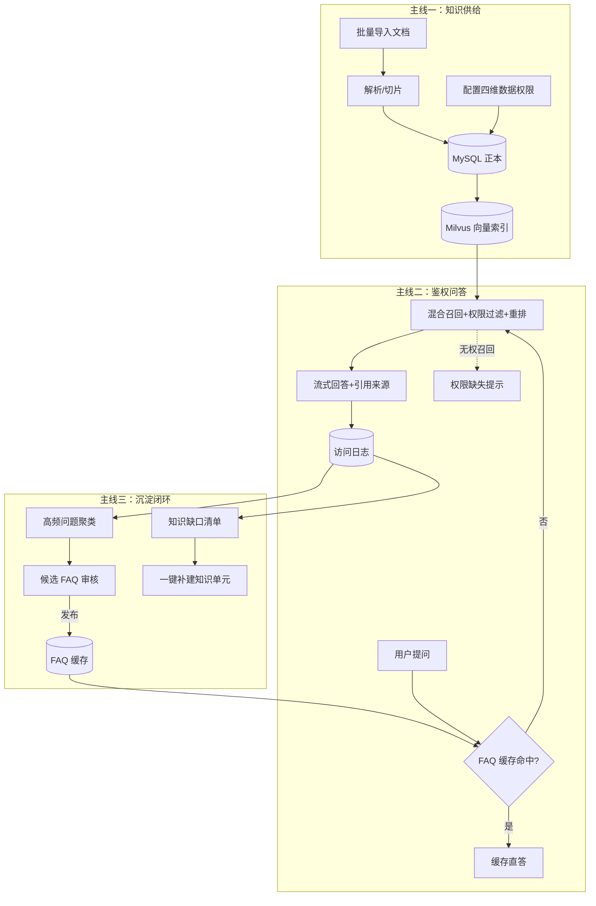
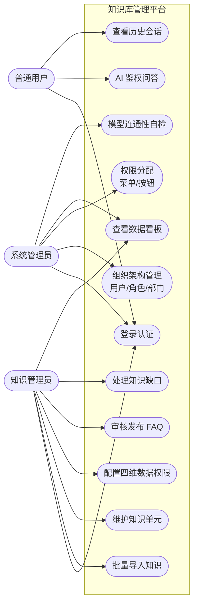

# 软件需求文档（SRD）— 企业级知识库管理平台 kb-platform

| 项 | 内容 |
|----|------|
| 文档版本 | v1.0 |
| 状态 | 已评审（设计对话确认） |
| 日期 | 2026-02-26 |
| 关联仓库 | github.com/nobodycare-no/kb-platform |
| 需求基线 | 《大模型项目实战》§2.9 知识库管理平台 |

---

## 1. 项目概述

### 1.1 项目背景
企业知识散落在网盘、聊天记录与个人经验中，存在三大痛点：**找不到**（检索命中率低）、**不可控**（缺乏细粒度权限，敏感知识裸奔）、**沉淀难**（高频问答无法自动转化为可复用资产）。直接使用通用大模型问答存在幻觉，且完全没有"谁能看什么"的概念。

### 1.2 项目目标
构建集 **知识维护、多维权限管理、AI 鉴权检索问答、数据看板、知识自动沉淀** 于一体的企业知识库管理平台。核心差异化能力是 **权限感知的 RAG**：召回之后、生成之前，逐单元执行数据权限鉴权，无权内容既不进入上下文、也不泄露其存在细节之外的信息（明确提示权限缺失）。

### 1.3 核心价值
1. **权限感知 RAG**：全局/部门/角色/个人四维数据权限（OR 逻辑）在检索链路内强制生效；
2. **FAQ 沉淀闭环**：高频问题自动挖掘 → 人工审核发布 → 缓存加速应答 → 降低 Token 成本；
3. **知识缺口驱动运营**：未命中问题自动聚类成缺口清单，指导知识补全；
4. **生产级工程形态**：AI 网关微服务、Milvus 向量索引可重建、GPU/CPU 分离部署。

## 2. 用户角色

| 角色 | 职责 | 关键操作 |
|------|------|---------|
| 系统管理员 | 平台治理 | 维护用户/角色/部门；分配菜单与按钮级操作权限；查看看板与 Token 消耗 |
| 知识管理员 | 内容运营 | 单篇/批量导入知识；维护知识单元；配置数据权限；审核发布 FAQ；维护知识缺口 |
| 普通用户（提问者） | 知识消费 | 登录后 AI 问答，按数据权限获得回答；对无权内容收到明确缺失提示 |

## 3. 业务流程总览

## 4. 用例模型

### 4.1 用例图

### 4.2 核心用例表

| 编号 | 用例 | 参与者 | 前置条件 | 主流程 | 扩展流程 |
|------|------|--------|---------|--------|---------|
| UC-04 | 批量导入知识 | 知识管理员 | 已登录；具备导入权限 | ①拖拽上传多文件(PDF/MD/DOCX/TXT) ②系统逐文件解析→切片→向量化→双写 MySQL/Milvus ③页面轮询展示逐文件进度与结果 | 单文件解析失败不影响其他文件（部分成功）；失败文件给出原因并可重试 |
| UC-06 | 配置数据权限 | 知识管理员 | 知识单元已存在 | ①打开权限配置弹窗 ②可选：全局公开开关 / 多选部门 / 多选角色 / 多选人员 ③保存后即时生效 | 全部留空 = 默认无任何权限（除创建人与超管） |
| UC-07 | AI 鉴权问答 | 普通用户 | 已登录 | ①输入问题 ②系统检查 FAQ 缓存 ③未命中则混合召回 ④回调权限接口过滤 ⑤重排拼装上下文 ⑥SSE 流式输出答案+引用来源卡片 | 召回含无权单元时输出"权限缺失提示"卡；embedding 服务故障时降级纯关键词检索并标注降级警告 |

其余用例（UC-02/03/05/08~12）为常规 CRUD 与查询交互，验收以 §7 验收标准为准。

## 5. 功能需求清单

优先级：P0 = 演示主线必需；P1 = 完整性必需。"规范"列指《大模型项目实战》§2.9 对应小节。

### FR-A 认证与组织权限

| 编号 | 需求 | 优先级 | 规范 |
|------|------|--------|------|
| FR-A01 | 用户名密码登录，签发 JWT（HS256，12h），返回 user_info 与 permissions | P0 | 2.9.8 |
| FR-A02 | 密码 bcrypt 哈希存储；登出后前端清除登录态 | P0 | 2.9.6 |
| FR-A03 | 用户管理：列表/新增/编辑/重置密码/启停用，关联部门与角色 | P0 | 2.9.3 |
| FR-A04 | 角色管理：角色 CRUD + 操作权限树（增删改查/AI 访问等 permission_code） | P0 | 2.9.3 |
| FR-A05 | 部门管理：树形结构、负责人、成员关联 | P0 | 2.9.3 |
| FR-A06 | 后端 RBAC 拦截器按 permission_code 校验；前端 `v-permission` 指令控制按钮显隐 | P0 | 2.9.5 |

### FR-B 知识维护

| 编号 | 需求 | 优先级 | 规范 |
|------|------|--------|------|
| FR-B01 | 单文件/多文件批量上传，支持 PDF、Markdown、Word(docx)、TXT | P0 | 2.9.3/2.9.6 |
| FR-B02 | 解析→切片（目标 500 字符，重叠 50，Markdown 标题感知）→向量化→入库，全程任务化 | P0 | 2.9.6 |
| FR-B03 | 导入进度逐文件可见，支持部分成功与错误行/原因提示 | P0 | 2.9.5 |
| FR-B04 | 知识单元 CRUD、搜索筛选（标题/分类/状态）、状态管理 | P0 | 2.9.3 |
| FR-B05 | 删除/更新知识单元时同步清理/更新向量索引 | P0 | 2.9.6 |

### FR-C 数据权限引擎

| 编号 | 需求 | 优先级 | 规范 |
|------|------|--------|------|
| FR-C01 | 知识单元默认无任何访问权限 | P0 | 2.9.4 |
| FR-C02 | 四类权限实体：global / department / role / user，可多实体混配，任一命中即放行（OR） | P0 | 2.9.4 |
| FR-C03 | `POST /api/knowledge/check-permissions`：入参 user_id + unit_ids，返回授权/未授权两组 ID | P0 | 2.9.8 |
| FR-C04 | 用户权限快照 Redis 缓存（TTL 300s），权限变更主动失效 | P1 | 2.9.6 |

### FR-D AI 鉴权问答

| 编号 | 需求 | 优先级 | 规范 |
|------|------|--------|------|
| FR-D01 | 问答前强制校验 JWT 登录态并携带用户身份上下文 | P0 | 2.9.4 |
| FR-D02 | 双路混合召回：Milvus 稠密向量 top50 + MySQL ngram 全文关键词 top20，RRF(k=60) 融合 | P0 | 2.9.6 |
| FR-D03 | 召回后调用 check-permissions 过滤；无权单元进入"权限缺失提示"，绝不进入 Prompt | P0 | 2.9.4 |
| FR-D04 | bge-reranker 重排取 top6 片段，带 [n] 引用编号拼装 Prompt，Qwen3-8B 流式生成 | P0 | 2.9.6 |
| FR-D05 | SSE 协议事件：`delta`（增量文本）/`sources`（引用卡片）/`unauthorized`（缺失提示）/`done`（用量统计）/`error` | P0 | 2.9.3 |
| FR-D06 | 多轮会话管理：会话列表、历史消息回放、追问上下文携带近 N 轮摘要 | P1 | 2.9.3 |
| FR-D07 | LLM 主备切换：vLLM Qwen3-8B 连续失败≥2 次切 OpenAI 兼容备用端点；embedding 故障降级关键词检索并在回答中标注 | P0 | 设计新增 |
| FR-D08 | 异步记录 qa_access_logs：提问、命中单元、授权/未授权明细、Token 三项计数、耗时 | P0 | 2.9.6 |

### FR-E 数据看板

| 编号 | 需求 | 优先级 | 规范 |
|------|------|--------|------|
| FR-E01 | 指标卡：Agent 访问次数、独立访客 UV、知识单元总数、Token 总消耗、平均响应时长 | P0 | 2.9.3 |
| FR-E02 | 排行榜：高频问题 TOP10、最常访问知识单元 TOP10 | P0 | 2.9.3 |
| FR-E03 | 趋势图：按日访问趋势、Token 消耗走势、响应时间分布（ECharts） | P1 | 2.9.3 |

### FR-F 知识沉淀

| 编号 | 需求 | 优先级 | 规范 |
|------|------|--------|------|
| FR-F01 | 定时挖掘：低置信/未命中提问向量化聚类，频次≥阈值(默认3)自动生成待审 FAQ | P0 | 2.9.9 |
| FR-F02 | FAQ 审核：通过（可编辑标准答案）→ published 并写入两级缓存；驳回 → rejected | P0 | 2.9.3 |
| FR-F03 | 两级 FAQ 缓存：Redis 精确归一化 hash + 已发布 FAQ 语义向量匹配（相似度≥0.92 直答） | P0 | 2.9.4 |
| FR-F04 | 知识缺口：最高相似度<0.35 或零召回的提问聚合为缺口项，统计频次，支持一键转知识单元草稿 | P0 | 2.9.3 |

### FR-G 运维支撑（设计新增）

| 编号 | 需求 | 优先级 | 规范 |
|------|------|--------|------|
| FR-G01 | `GET /health/models`：一键检测 LLM/embedding/reranker/Milvus 连通性 | P1 | 设计新增 |
| FR-G02 | 一键重建向量索引命令（MySQL 正本 → Milvus 全量重建） | P0 | 设计新增 |
| FR-G03 | 种子数据脚本：企业 IT/行政制度演示知识库（IT部/HR部/财务部三部门权限矩阵） | P0 | 设计新增 |

## 6. 非功能需求

| 编号 | 类别 | 指标 |
|------|------|------|
| NFR-01 | 性能 | 流式首 token ≤ 3s（P95，GPU 就绪时）；50 页文档导入解析+索引 ≤ 60s |
| NFR-02 | 性能 | 权限判定单次 ≤ 50ms（命中 Redis 快照时 ≤ 5ms） |
| NFR-03 | 安全 | 密码 bcrypt；JWT 有效期 12h；服务间 X-Internal-Token；上传白名单扩展名+20MB 上限 |
| NFR-04 | 安全 | 所有模型端点支持 API Key；`.env` 不入 git；DB/Redis/Milvus 不暴露公网端口 |
| NFR-05 | 可靠性 | LLM 主备自动切换；embedding 故障降级关键词检索；Milvus 可全量重建 |
| NFR-06 | 可维护性 | FastAPI 自动产出 OpenAPI 文档；核心逻辑（权限引擎/融合算法）pytest 覆盖 |
| NFR-07 | 兼容性 | Chrome / Edge 最新两个大版本；1366×768 以上分辨率 |
| NFR-08 | 可部署性 | 本机 Docker Desktop 与云端 Linux 同一套 compose；差异仅存在于 .env |
| NFR-09 | 存储隔离 | 向量检索主路径不得同步依赖关系库；关键词腿并发执行且超时≤200ms 自动降级；权限判定优先 Redis 快照（目标命中率>95%） |

## 7. 验收标准（对应规范 §2.9.11）

| 编号 | 验收项 | 关联 FR |
|------|--------|---------|
| AC-01 | 完成用户登录、角色管理、部门管理与菜单/按钮级操作权限分配 | FR-A03~06 |
| AC-02 | 单篇与批量文档导入成功，拆分为知识单元并完成检索入库 | FR-B01~05 |
| AC-03 | 知识单元 CRUD，支持混合配置四类数据权限 | FR-B04、FR-C02 |
| AC-04 | 四维权限任一命中即可访问该知识单元 | FR-C02/03 |
| AC-05 | AI 对话强制校验登录态，调用鉴权接口过滤未授权单元并对无权召回输出缺失提示 | FR-D01/03/05 |
| AC-06 | 看板正确展示访问次数、UV、单元数、双榜、Token 与耗时趋势 | FR-E01~03 |
| AC-07 | 自动挖掘高频问题生成推荐 FAQ，审核发布写入缓存加速应答 | FR-F01~03 |
| AC-08 | 自动识别未命中间题生成知识缺口列表并可查看频次 | FR-F04 |
